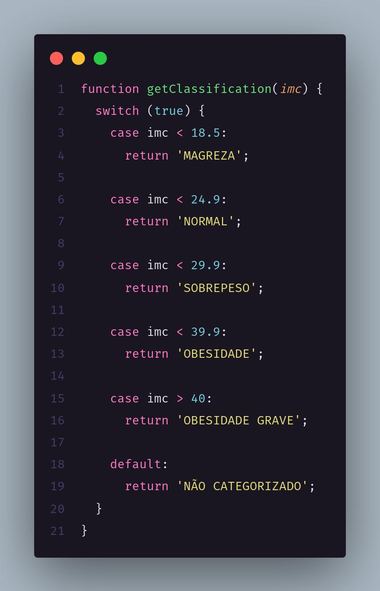

## Javascript

- Variáveis

  - Não tem tipagem estática, logo sua tipagem é dinâmica (uma variável pode receber diversos tipos de valores).
  - Para declarar utilizamos o "var"

  ```jsx
  var variavel;
  ```

  - principais tipos que a variável pode receber é: string, inteiro, float, booleano, vetor, objeto.

  ```jsx
  var nome = "Gabriel Prando";
  var idade = 20;
  var peso = 70.4;
  var estudante = true;
  
  var tecnologia = ["javascript", "css", "html"];
  
  var pessoa = {
    nome = "gabriel",
    idade = 20,
    peso = 70.4,
    estudante = true
  }
  ```

- Funções

  - sintaxe

    ```jsx
    function name([param,[, param,[..., param]]]) {
       [statements]
    }
    ```

    `name`O nome da função.

    `param`O nome de um argumento a ser passado para a função. Uma função pode ter atè 255 argumentos.

    `statements`As instruções que compõem o corpo da função.

    ------

  - exemplo

  ```jsx
  function sum(x, y){
      return x + y;
  }
  
  var result = sum(2+3);
  console.log(result);
  ```

- Condicionais

  

  - If e else if são iguais a qualquer outra linguagens

  ```jsx
  if ( condição ) {
  	// Ação
  } else if ( outra condição ) {
  	// Ação
  } else {
  	// Ação final se nenhuma condição for verdadeira
  }
  ```

  - Switch case também é igual a outras linguagens

  ```jsx
  var expr = 'Papayas';
  switch (expr) {
    case 'Oranges':
      console.log('Oranges are $0.59 a pound.');
      break;
    case 'Mangoes':
    case 'Papayas':
      console.log('Mangoes and papayas are $2.79 a pound.');
      // expected output: "Mangoes and papayas are $2.79 a pound."
      break;
    default:
      console.log(`Sorry, we are out of ${expr}.`);
  }
  ```

  

- ```html
  
  ```
<!DOCTYPE html>
  <html lang="en">
<head>
      <title>Curso JavaScript</title>
</head>
  <body>

      <script>
          function retornoSexo(sexo) {
            // M , F
              /*if(sexo === 'M'){
                return 'Masculino';
              }else if(sexo === 'F'){
                return 'Masculino';
              }else{
                  return 'outro';
              }*/
      
              switch (sexo) {
                  case 'M':
                    return 'Masculino';
                  case 'F':
                    return 'Feminino';
                  default:
                    return  'outro';
              }
          }
          var resultado = retornoSexo('M');
          console.log(resultado);
      </script>
  </body>
  </html>
```
  

  
- Operadores lógicos

  ```html
  <!DOCTYPE html>
  <html lang="en">
  <head>
      <title>Curso JavaScript</title>
  </head>
  <body>
      
      <script>
  
          // AND(&&) , OR (||), NOT (!==)
          var sexo = 'M', idade = 23;
  
          /*if (sexo === 'M' || idade >= 18){
              console.log('ok');
          }*/
  
          var masculino = sexo === 'M'; // true
          console.log(masculino);
  
      </script>
  </body>
  </html>
  
```

  

- Condição Ternária

  ```html

  <!DOCTYPE html>
<html lang="en">
  <head>
      <title>Curso JavaScript</title>
  </head>
  <body>
    
      <script>

          var sexo = 'M';

          var retorno = (sexo === 'M') ? 'Masculino' : 'Feminino';
  
          console.log(retorno);
  
      </script>
  </body>
</html>
  ```

- 

- Estrutura de repetição

  - FOR

    - Formado por três partes: inicialização, condição e incremento. A sintaxe é:

      ```jsx
      for (var i = 0; i <= 10; i++) {  //código a ser executado até a condição se tornar falsa}
      }
      ```

  - FOR IN

    - É utilizado quando não sabemos quantas vezes temos que iterar sobre um array ou objeto.

      ```jsx
      var arr = [1,2,3];
      for(var n in arr) {
        console.log(n);
      }
      ```

  - FOREACH

    - Utilizamos o `foreach` quando queremos percorrer as propriedades de um objeto ou os itens de um array, sem precisamos nos preocupar em contar quantos são.

      ```jsx
      var arr = [1,2,3];
      arr.forEach(function(each) {  
          console.log(each);
        }
      );
      ```

  - WHILE

    - Funciona basicamente igual ao for, e é possível sempre trocar o for() por um while(). Escolhemos um ou outro pela clareza do que estamos fazendo. Geralmente preferimos utilizar o loop for() para interar com contadores e loops while() até que alguma condição mude (de true para false, por exemplo).

      ```jsx
      var x = true;
      while(x) {  
          console.log('Jane Doe');  
          x = false;
      }
      ```

      - Nesse caso acima, o console.log será executado uma única vez, pois eu altero para false a variavel x, logo na primeira interação do laço. Mas eu poderia ter feito algo assim:

    ```jsx
    var i = 1,    x = 2; 
    while(x < 20) {  
      x = x + (x * i);   
      console.log('O valor atual de x é: ' + x);  
      i++;
    }
    ```

  - DO WHILE

    - Segue o mesmo princípio do while, mas o corpo é sempre executado pelo menos uma vez, independente da condição, pois primeiro ele faz **do** e depois testa a condição.

    ```jsx
    do {  
      console.log('Jane Doe');
    } while(false);
    ```

    - Apesar da condição já começar como falsa, veremos a string "Jane Doe" uma vez no console do browser.

- Manipulação de DOM

  - inline

    ```html
    // HTML
    <buttom> clique aqui </buttom>
    
    // JS
    var btn = document.querySelector('button');
    
    btn.onclick = function() {
      alert('olá mundo')
    }
    ```

  - Manipulando a dom

    ```jsx
    var btn = document.querySelector('button');
    
    function random(number) {
      return Math.floor(Math.random()*(number+1));
    }
    
    btn.onclick = function() {
      var rndCol = 'rgb(' + random(255) + ',' + random(255) + ',' + random(255) + ')';
      document.body.style.backgroundColor = rndCol;
    }
    ```

- Promises e requisições assíncronas

  - Uma *Promise* é um objeto em javascript usado para processamento assíncrono (como a nossa requisição) e possui duas funções principais, o *.then()* e o *.catch()*. O *.then()* é uma função de *callback* que dispõe do valor processado, já o *.catch()* é chamado somente se houver um erro inesperado.

    ```jsx
    fetch('<https://api.adviceslip.com/advice>')
    .then(function(response){
      console.log(response);
    })
    .catch(err){
      console.log(err)
    }
    ```

- Links e recomendações 
  - [Para iniciantes](https://tableless.github.io/iniciantes/manual/js/controles-de-fluxo-e-controles-de-repeticao.html)
  - [Laços e iterações](https://developer.mozilla.org/pt-BR/docs/Web/JavaScript/Guide/Lacos_e_iteracoes)